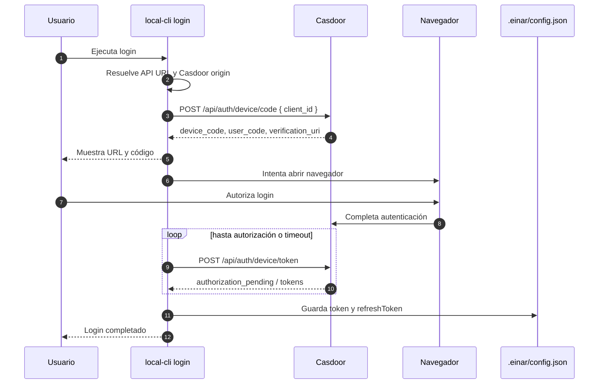

# sync

## Instalación del CLI

### Opción 1: `go install`

```bash
go install github.com/Ignaciojeria/sync@latest
```

Eso instala el binario `sync` en tu `GOBIN` o en `$(go env GOPATH)/bin`.
Asegúrate de tener esa carpeta en el `PATH`.

Verificar:

```bash
sync --help
```

### Opción 2: descargar desde GitHub Releases

Descarga el archivo correspondiente a tu sistema operativo desde:

- `linux_amd64` / `linux_arm64`
- `darwin_amd64` / `darwin_arm64`
- `windows_amd64` / `windows_arm64`

Luego:

#### Linux / macOS

```bash
tar -xzf sync_<version>_<os>_<arch>.tar.gz
chmod +x sync
sudo mv sync /usr/local/bin/sync
sync --help
```

#### Windows (PowerShell)

```powershell
Expand-Archive .\sync_<version>_windows_<arch>.zip -DestinationPath .\sync
.\sync\sync.exe --help
```

Si quieres dejarlo globalmente instalado, mueve `sync.exe` a una carpeta incluida en tu `PATH`.

### Publicar una release

Cada tag que matchee `v*` dispara GoReleaser en GitHub Actions.

```bash
git tag v0.1.0
git push origin v0.1.0
```

## Compilar el CLI local

Desde la raíz del repo:

```powershell
go build -o .\local-cli.exe .\cmd\local-cli
```

En bash:

```bash
go build -o ./local-cli ./cmd/local-cli
```

Esto deja el binario en la raíz actual. Luego el propio CLI crea la carpeta `.einar/` cuando la necesite.

---

## Validar que compiló

PowerShell:

```powershell
.\local-cli.exe --help
.\local-cli.exe init --help
.\local-cli.exe vm-agent --help
```

Bash:

```bash
./local-cli --help
./local-cli init --help
./local-cli vm-agent --help
```

---

## Login con el CLI

Antes de ejecutar `init`, el CLI necesita un token.

### Opción 1: login interactivo recomendado

PowerShell:

```powershell
.\local-cli.exe login
```

Bash:

```bash
./local-cli login
```

Si quieres sugerir una cuenta específica desde el comando:

```bash
./local-cli login tu-email@empresa.com
```

Qué hace este flujo:

1. Resuelve `APIURL`
   - desde `--api-url`
   - o `EINAR_API_URL`
   - o config global previa
   - fallback: `https://einar.exe.xyz`
2. Deriva el origen de Casdoor
3. Pide un **device code** a Casdoor
4. Te muestra una URL de verificación y, si aplica, un `user_code`
5. Abre el navegador
6. Espera a que autorices el dispositivo
7. Hace polling del token endpoint
8. Guarda `token` y `refreshToken` en:
   - `./.einar/config.json` relativo al ejecutable del CLI

Salida esperada:

```text
🔐 Login por código de dispositivo
Código: XXXX-XXXX
Abrí esta URL en tu navegador:
https://.../login/oauth/...

✅ Login completado en .../.einar/config.json
Token: eyJ....abcd
```

### Opción 2: guardar token manualmente

Si ya tienes un bearer token:

PowerShell:

```powershell
.\local-cli.exe login --token TU_TOKEN
```

Bash:

```bash
./local-cli login --token TU_TOKEN
```

Esto guarda el token sin abrir navegador.

### Variables y flags útiles

- `--api-url https://tu-api.example.com`
- `--casdoor-origin https://tu-casdoor.example.com`
- `--oidc-client-id einar-app`
- `EINAR_API_URL`
- `EINAR_CASDOOR_ORIGIN`
- `EINAR_OIDC_CLIENT_ID`
- `EINAR_TOKEN`

### Mermaid del proceso de login



### Relación entre `login` e `init`

`init` usa el token guardado por `login` para hacer:

```http
POST /api/projects
Authorization: Bearer <token>
Content-Type: application/json

{
  "name": "mi-proyecto",
  "public": true,
  "visibility": "public"
}
```

Importante:

- **el CLI no envía `tag` en este POST**
- el backend deriva el `slug`
- el backend/provisioner crea la VM con algo como:

```text
new --name=<slug> --tag=<slug> --json
```

---

## Probar `init`

### Flujo completo

PowerShell:

```powershell
.\local-cli.exe init test-project
```

Bash:

```bash
./local-cli init test-project
```

Este flujo ahora también:

- compila `vm-agent`
- lo sube a la VM provisionada
- lo instala en `~/.einar/bin/vm-agent`

---

## Probar `init` sin desplegar `vm-agent`

Útil para aislar problemas del flujo base de provisioning.

PowerShell:

```powershell
.\local-cli.exe init test-project --skip-vm-agent-deploy
```

Bash:

```bash
./local-cli init test-project --skip-vm-agent-deploy
```

---

## Instalar auth custom de pi durante `init`

Si además quieres dejar configurada la extensión custom de `pi` en la VM:

PowerShell:

```powershell
.\local-cli.exe init test-project --pi-proxy-url https://tu-proxy.example.com
```

Bash:

```bash
./local-cli init test-project --pi-proxy-url https://tu-proxy.example.com
```

Eso instala en la VM una extensión de `pi` en:

```text
~/.pi/agent/extensions/einar-openai.ts
```

Y guarda metadata en:

```text
~/.einar/pi-auth.json
```

---

## Comandos manuales de `vm-agent`

### Compilar solamente `vm-agent`

PowerShell:

```powershell
.\local-cli.exe vm-agent build
```

Bash:

```bash
./local-cli vm-agent build
```

Salida local esperada:

```text
.einar/bin/vm-agent-linux-amd64
```

### Subirlo manualmente a la VM

PowerShell:

```powershell
.\local-cli.exe vm-agent upload
```

Bash:

```bash
./local-cli vm-agent upload
```

### Compilar y subir en un paso

PowerShell:

```powershell
.\local-cli.exe vm-agent deploy
```

Bash:

```bash
./local-cli vm-agent deploy
```

### Instalar auth custom de pi manualmente

PowerShell:

```powershell
.\local-cli.exe vm-agent install-pi-auth --proxy-url https://tu-proxy.example.com
```

Bash:

```bash
./local-cli vm-agent install-pi-auth --proxy-url https://tu-proxy.example.com
```

---

## Verificar que `vm-agent` quedó en la VM

Ejemplo:

```bash
ssh <vm-ssh-destination> 'ls -la ~/.einar/bin && ls -la ~/.pi/agent/extensions'
```

Se espera ver:

- `~/.einar/bin/vm-agent`
- `~/.pi/agent/extensions/einar-openai.ts` si instalaste auth custom de pi

---

## Validación rápida recomendada

1. Compilar el CLI local
2. Ver ayuda del binario
3. Probar `init` con `--skip-vm-agent-deploy`
4. Probar `init` completo
5. Si aplica, probar `--pi-proxy-url`

Secuencia sugerida en PowerShell:

```powershell
go build -o .\local-cli.exe .\cmd\local-cli
.\local-cli.exe --help
.\local-cli.exe init test-project --skip-vm-agent-deploy
.\local-cli.exe init test-project
.\local-cli.exe init test-project --pi-proxy-url https://tu-proxy.example.com
```
